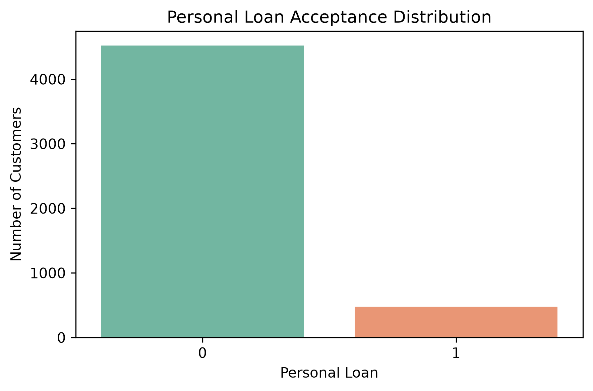
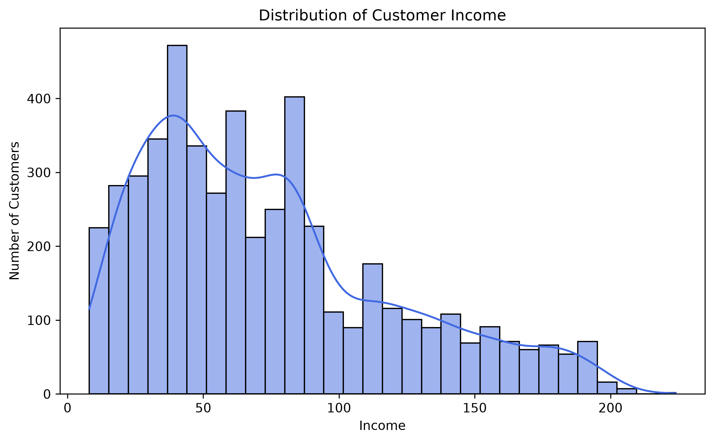
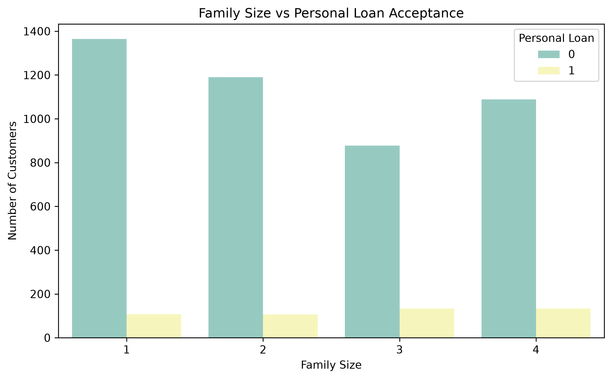
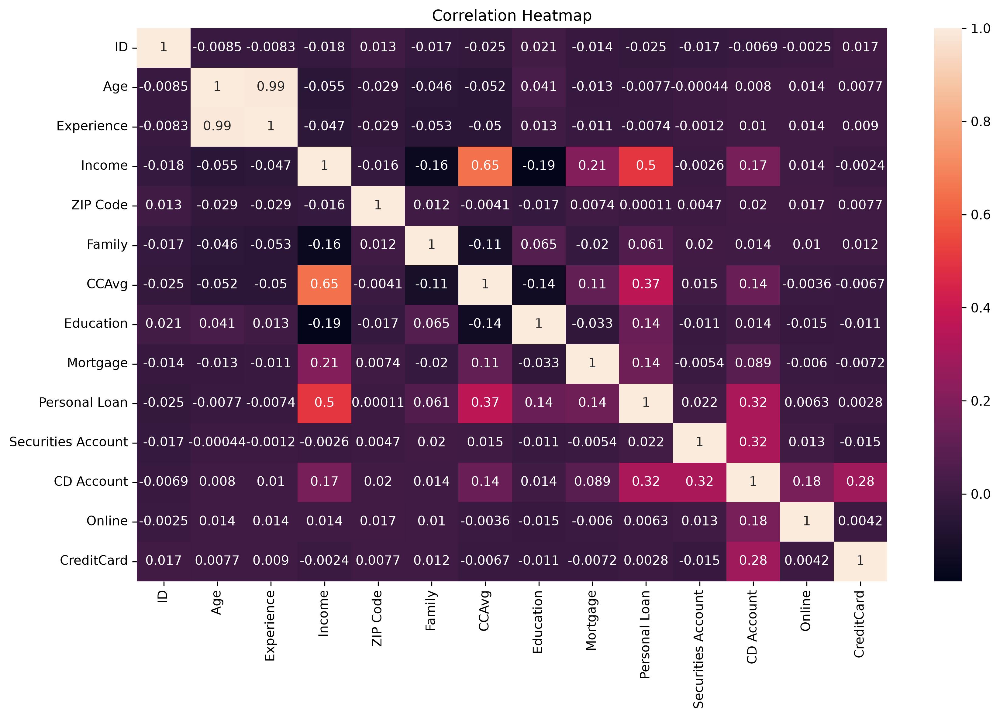
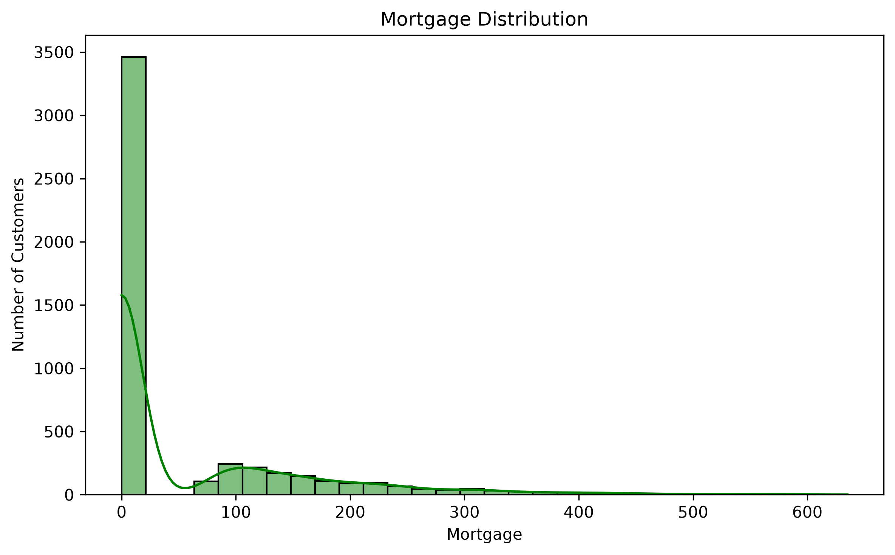

# Loan & Credit Risk Analytics

An end-to-end Data Analytics project focused on analyzing customer financial data, identifying loan acceptance patterns, and building predictive machine learning models to support business decision-making.

---

# Project Objective

Banks need to identify customers who are most likely to accept a personal loan while reducing marketing costs and improving campaign effectiveness.

This project uses SQL, Python, Power BI, and Machine Learning to analyze customer behavior, uncover business insights, and predict loan acceptance.

---

# Tech Stack

- SQL (MySQL)
- Python
- Pandas
- NumPy
- Matplotlib
- Seaborn
- Scikit-learn
- Power BI
- Excel
- Git & GitHub

---

# Project Structure

```text
Loan-Credit-Analytics/
│
├── dataset/
│   ├── Bank_Personal_Loan_Modelling.xlsx
│   ├── loan_data.csv
│   └── cleaned_loan_data.csv
│
├── images/
│   ├── correlation_heatmap.png
│   ├── Family_Size_vs_Personal_Loan.png
│   ├── income_distribution.png
│   ├── loan_distribution.png
│   └── mortgage_dist.png
│
├── models/
│   └── Rf_model.pkl
│
├── powerbi/
│
├── python/
│   ├── 01_loadData.ipynb
│   ├── 02_eda_visualization.ipynb
│   └── 03_ML.ipynb
│
├── reports/
│
├── sql/
│   ├── day1.sql
│   ├── day2.sql
│   ├── day3.sql
│   └── day4.sql
│
├── .gitignore
├── README.md
└── requirements.txt
```

---

# SQL Analysis

Performed SQL analysis using MySQL covering:

- Aggregate Functions
- GROUP BY
- ORDER BY
- WHERE
- HAVING
- CASE Statements
- Joins
- Subqueries
- Common Table Expressions (CTEs)
- Window Functions
  - ROW_NUMBER()
  - RANK()
  - DENSE_RANK()
  - PARTITION BY

---

# Python Analysis

Performed data preprocessing using Pandas:

- Data Loading
- Data Cleaning
- Missing Value Analysis
- Duplicate Removal
- Data Validation
- Summary Statistics
- Exploratory Data Analysis (EDA)

---

# Data Visualization

Visualizations created using Matplotlib and Seaborn:

- Loan Distribution
- Income Distribution
- Family Size vs Personal Loan
- Mortgage Distribution
- Correlation Heatmap

---

# Machine Learning

Built classification models to predict whether a customer will accept a personal loan.

### Models Used

- Logistic Regression
- Random Forest Classifier

### Evaluation Metrics

- Accuracy
- Precision
- Recall
- F1 Score
- Confusion Matrix
- Classification Report

The Random Forest model achieved better performance and was selected as the final prediction model.

---

# Power BI Dashboard

Interactive dashboard includes:

- Loan Acceptance Analysis
- Income Analysis
- Customer Demographics
- Family Size Analysis
- Mortgage Analysis
- Interactive Filters and Slicers

*(Dashboard screenshots will be added after dashboard completion.)*

---

# Key Business Insights

- Approximately **90.4%** of customers did not accept a personal loan, while **9.6%** accepted.
- Higher-income customers showed a greater likelihood of accepting personal loans.
- Education level influenced loan acceptance behavior.
- Customers with larger family sizes were more likely to accept personal loans.
- Mortgage values varied significantly among customers.
- Correlation analysis helped identify relationships between customer financial attributes.

---

# Project Screenshots

## Loan Distribution



---

## Income Distribution



---

## Family Size vs Personal Loan



---

## Correlation Heatmap



---

## Mortgage Distribution



---

# Future Improvements

- Complete interactive Power BI dashboard
- Hyperparameter tuning for Machine Learning models
- Deploy the prediction model using Streamlit
- Connect the project with a live SQL database
- Build an automated data pipeline

---

# Skills Demonstrated

- SQL Querying
- Data Cleaning
- Exploratory Data Analysis
- Data Visualization
- Machine Learning
- Business Analytics
- Dashboard Development
- Version Control using Git

---

#  Author

**Tanay Chaturvedi**

If you found this project useful, feel free to use the repository.